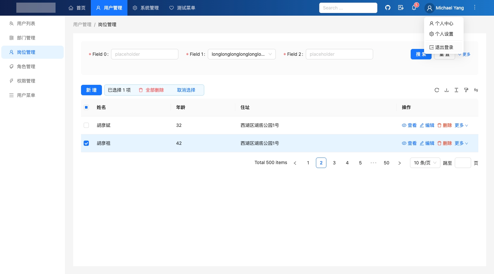

# React-Better-Admin🔥

## 特点

- 1、基于 TypeScript 🔥🔥🔥
- 2、基于最新的 React 18 🔥🔥🔥
- 3、基于最流行的设计风格 Ant Design v5.x 🔥🔥
- 4、基于 React Router v6.x 做路由管理，支持懒加载 🔥🔥
- 5、基于 Vite4 做项目编译打包工具 🔥🔥
- 6、基于 Redux、Redux Toolkit 做状态管理 🔥🔥
- 7、基于 RTK Query 请求管理 👍
- 8、完善的 **国际化** 配置支持 👍
- 9、完善的 **登录认证** 配置支持 👍
- 10、完善的 **权限管理 + 动态菜单** 配置支持 👍
- 11、完善的 Mock 数据支持
- 12、友好的代码风格和注释...
- 13、基于 MIT 开源协议，放心商用，永久免费 👍👍👍
- 14、更多小惊喜...


## 为什么不用 Ant Design Pro

Ant Design Pro 是 Ant Design 官方推出的非常优秀的、开箱即用的、中台前端解决方案，而 React-Better-Admin
也是向 Ant Design Pro 学习，对标 Ant Design Pro，打造 "另一套" 优秀的、开箱即用的、中台前端解决方案。

为什么不直接用 Ant Design Pro ，而全新开发 React-Better-Admin 呢？ 我们团队主要认为有以下几个原因：

- 1、Ant Design Pro 是基于阿里自己的 Umi 进行开发的，我们团队不熟悉 Umi ，并且 Umi 并不像 Redux、Vite4、React Router 那么流行（不给出数据了）。

- 2、Umi 自己包含了代码构建、测试、路由、状态管理等能力，它既是一个打包工具、也是一个运行时依赖框架，从用户需求角度来讲：
Umi = Vite4 + React Router + Redux + RTK Query （或者 Axios 等）。但是，在 React 的生态中，我们除了使用 React 来构建 web 产品以外，还可能通过 React-Native 来构建 app 应用，在这方面：
React Router、Redux 都是支持非常友好，而 Umi 视乎没有太多案例。

- 3、我们（包括用户）基于 React-Better-Admin 开发出的商业产品进行销售的时候，客户公司的 ”技术架构师“ 往往有很重话语权，而纵观整个互联网，使用 "React Router + Redux" 的架构师，好像要比 Umi 多一些。

但无论如何，Ant Design Pro 非常优秀，我们努力向它靠齐。


## 应用截图

**登录页面**


**岗位管理**


## 开始使用 React-Better-Admin

**Clone**

```shell
git clone https://gitee.com/better-admin/react-better-admin.git
```

**Install**

```shell
cd react-better-admin
npm install
```

**Run**

```shell
vite
```


